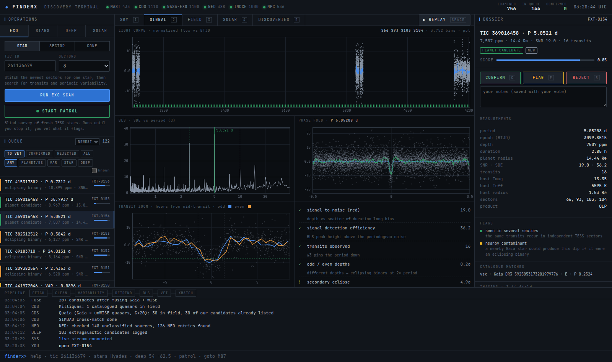
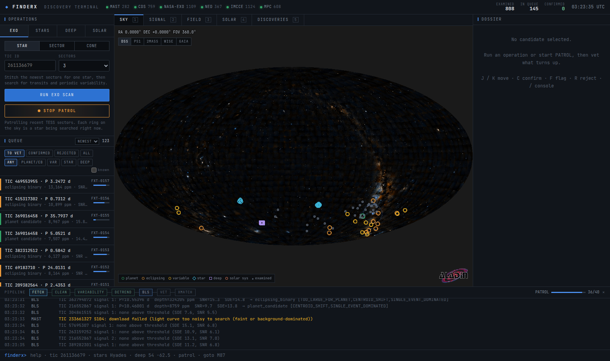
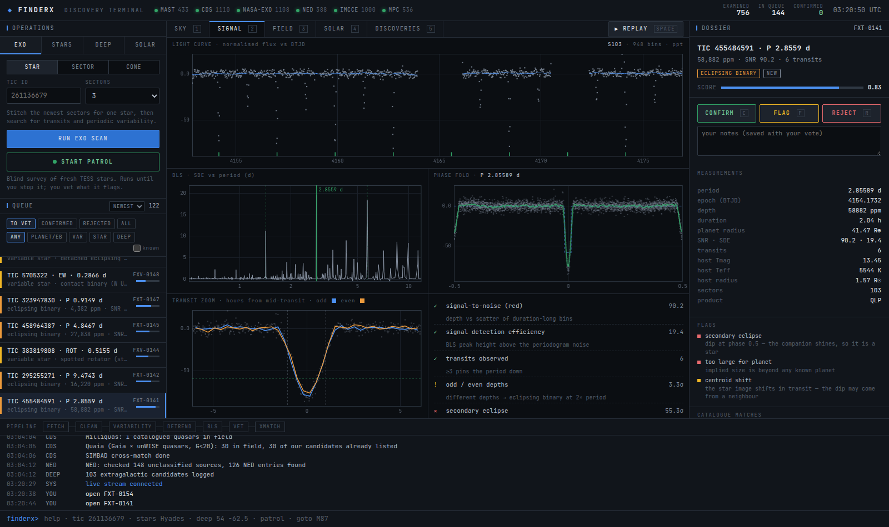
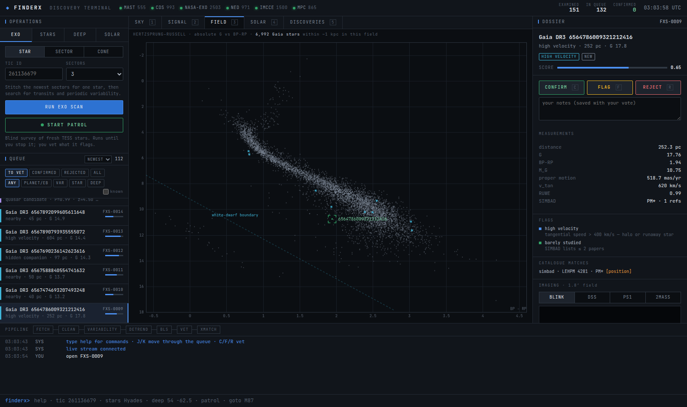
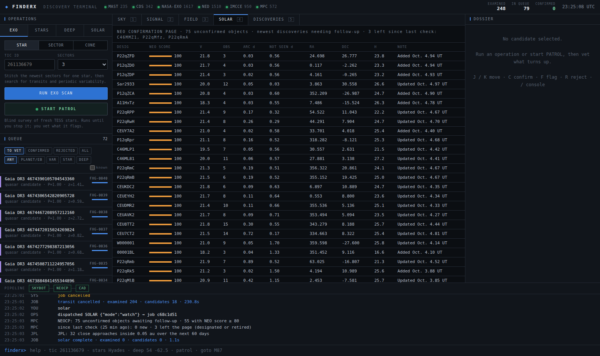

# finderX

**A discovery terminal for the night sky.** finderX pulls real survey data —
TESS light curves, Gaia DR3 astrometry, AllWISE colours, the Minor Planet
Center's live feeds — runs the searches professionals run, and puts every
signal it finds in front of you to vet. The machine does the compute; you
make the calls.



```bash
./start.sh            # first run builds .venv, then opens http://127.0.0.1:5050
```

Python 3.10+. No API keys. Everything is public data.

The first start loads **[first light](docs/FIRST_LIGHT.md)**: the
candidates from the survey run while finderX was being built (809 TESS
stars, three Gaia fields, two deep fields), with light curves and analyst
notes attached. They include a hot-Jupiter candidate seen in four sectors,
11 eclipsing binaries no catalogue lists, and a VSX correction ready to
submit. Nothing has been voted on yet; that part is yours.

---

## What you can find

| Engine | Data | What it hunts | Where a real one goes |
|---|---|---|---|
| **EXO** | TESS light curves (SPOC 2-min, TESS-SPOC & QLP full-frame) via MAST | Transiting planets, eclipsing binaries, periodic variable stars | Planets → ExoFOP **CTOI**. Variables & EBs → AAVSO **VSX** |
| **STARS** | Gaia DR3 (VizieR mirror) × SIMBAD × Gentile Fusillo+21 × Gaia DR3 orbit solutions | High-velocity halo/runaway stars, unstudied stars within 50 pc, hidden companions (RUWE > 2), ultracool dwarfs, white dwarfs nobody has catalogued | Literature / research note |
| **DEEP** | Gaia DR3 QSO & galaxy classifier × AllWISE × Milliquas × Quaia × SIMBAD × NED | Quasar candidates with no spectroscopic classification (strongest when Gaia, WISE colours and zero motion all agree), dust-obscured AGN, uncatalogued galaxies | Spectroscopic follow-up lists |
| **SOLAR** | MPC NEO Confirmation Page, JPL close-approach API, IMCCE SkyBoT | Newly found objects still awaiting confirmation, upcoming close approaches, every known asteroid in a field with its motion | Watch only — see *Honest limits* |

**PATROL** is the hands-off mode: it keeps drawing random, never-examined
stars from the newest TESS sectors (QLP full-frame light curves, ~1–2 million
stars per sector), skips anything already known as a TOI, community TOI,
planet host or catalogued eclipsing binary, and searches each one. You come
back to a queue.

## How a candidate is vetted

Open anything in the queue and the **SIGNAL** view replays the analysis:

1. the raw light curve draws in with its detrending trend and transit ticks,
2. the BLS (or Lomb–Scargle) periodogram sweeps up to its peak,
3. the points **fold** from time into orbital phase — watch the dip assemble,
4. a zoom on the transit splits odd and even events (unequal depths ⇒ binary).

Next to it, the vetting tests a TESS follow-up team would run, each with a
pass / warn / fail state and a one-line explanation:

- red-noise SNR (Pont+06) and signal detection efficiency
- odd/even depth difference, secondary eclipse at phase 0.5
- transit shape (box/U vs V), duration vs. what the host star allows
- implied radius, single-event dominance, proximity to data gaps
- centroid shift during transit, and **every Gaia neighbour within two TESS
  pixels bright enough to fake the dip** if it were an eclipsing binary
- **multi-sector re-check**: a planet-like signal from one sector is
  automatically re-searched with up to three more sectors of the same
  star. Noise does not repeat, and the longer baseline often reveals an
  eclipsing binary at its true period. In the first-light run this cut
  10 single-sector candidates to 1 survivor and 3 binaries.
- **common-mode systematics**: every event's mid-time goes into a per-sector
  register; a "transit" that lands at the same instants as dips on other,
  unrelated stars is the spacecraft, not a planet, and is filed away
  (retroactively too, as the register fills up)
- catalogue cross-match: TOI, CTOI, NASA Exoplanet Archive, TESS EB catalogue,
  VSX, Gaia DR3 variability and eclipsing-binary periods (searched within one
  TESS pixel, because a blended neighbour is often the real source)

Then you press **C** (confirm), **F** (flag) or **R** (reject). Confirmed
candidates collect in **DISCOVERIES**; **REPORT** produces the
submission-ready text and tells you where it goes.

STARS candidates get a Hertzsprung–Russell diagram of their field and a
**blink comparator** (1990s photographic plate vs. Pan-STARRS) so you can
watch a high-proper-motion star move. DEEP candidates get the WISE
colour–colour diagram with the AGN line and Legacy Surveys imaging.

| | |
|---|---|
|  |  |
| PATROL on the all-sky map: every ring is a star being searched | a new detached eclipsing binary from the first run |
|  |  |
| a 620 km/s halo star on its field's HR diagram | live NEO Confirmation Page |

## The terminal

```
┌ FINDERX  ● MAST ● CDS ● NASA-EXO ● NED ● IMCCE ● MPC      EXAMINED  IN QUEUE  CONFIRMED  UTC ┐
├ OPERATIONS ─────────┬ SKY · SIGNAL · FIELD · SOLAR · DISCOVERIES ────────────┬ DOSSIER ──────┤
│ EXO STARS DEEP SOLAR │                                                        │ vote C / F / R│
│ [ PATROL ]           │   sky atlas with live scan pings, cone sweeps,         │ measurements  │
│ QUEUE (to vet)       │   lock-on reticles — or the animated signal view       │ flags + why   │
│  FXT-0012 …          │                                                        │ imaging, links│
├──────────────────────┴────────────────────────────────────────────────────────┴───────────────┤
│ PIPELINE  FETCH ▸ CLEAN ▸ VARIABILITY ▸ DETREND ▸ BLS ▸ VET ▸ XMATCH          jobs / progress │
│ live log …                                                                                    │
│ finderx> tic 261136679                                                                        │
└───────────────────────────────────────────────────────────────────────────────────────────────┘
```

Keyboard: **J/K** move through the queue · **C/F/R** vote · **1–5** views ·
**Space** replays the fold · **/** focuses the console.

Console commands (Tab completes):

```
tic 261136679 [sectors=3]      sector 100 [n=30]        cone "NGC 2516" r=0.2
patrol | patrol stop           stars Hyades r=1         deep 54 -62.5 r=0.5
random stars | random deep     solar neocp | approaches | field 10 5 r=1
goto M87 fov=1                 survey dss|ps1|2mass|wise|gaia
open FXT-0012                  confirm|flag|reject [note]
queue tovet|confirmed|all      export csv                stop all
```

Try `tic 261136679` first: that is π Mensae, and finderX recovers its known
super-Earth (π Men c, P = 6.27 d, 2.0 R⊕) from 270 ppm transits — a good
sense of what a real signal looks like before you go hunting.

## Running it headless (or letting Claude run it)

Everything the UI does has a CLI, writes to the same database, and shows up
in the UI's queue:

```bash
.venv/bin/python -m finderx patrol --rounds 10 --n 40
.venv/bin/python -m finderx scan stellar --name "NGC 2516" --radius 1
.venv/bin/python -m finderx queue --status new
.venv/bin/python -m finderx show FXT-0012
.venv/bin/python -m finderx note FXT-0012 "centroid clean; neighbour 9″ away could still be it"
.venv/bin/python -m finderx export --status confirmed --format csv
.venv/bin/python -m finderx bundle --out mine.json.gz       # share candidates + plots + notes
.venv/bin/python -m finderx import docs/first-light.json.gz
```

`CLAUDE.md` tells a Claude Code session how to drive surveys and triage the
queue: it runs the compute and leaves **analyst notes**, and it never casts
votes — those stay yours.

## Architecture

```
finderx/
├── lightcurve.py      MAST product discovery · FITS → normalised flux · gap-aware robust detrend
├── analysis.py        iterative BLS + vetting tests · Lomb–Scargle + variable typing   (pure, tested)
├── catalogs.py        TOI / CTOI / planets / TESS-EB indices (cached daily) · VSX & Gaia-var cones
├── net.py             TAP (VizieR, SIMBAD, NED, NASA), MAST, CDS X-Match, Sesame — with retries
├── engines/           transit · stellar · galaxy · solar        each: run(ctx) -> summary
├── jobs.py            worker threads, cancellation, event bus → SSE / CLI
├── db.py              SQLite: jobs, examined targets, candidates, plot payloads
├── server.py          FastAPI: REST + /api/stream (Server-Sent Events)
├── report.py          submission text + CSV export
├── __main__.py        CLI
└── web/               terminal UI — vanilla ES modules, canvas plots, Aladin Lite sky
```

State lives in `data/` (git-ignored); set `FINDERX_DATA` to move it.
Tests are offline and synthetic: `.venv/bin/python -m pytest -q`.

## Honest limits

- **A candidate is not a discovery.** Most transit-like signals in TESS are
  eclipsing binaries, blends or systematics. finderX filters the obvious
  ones and shows you the evidence for the rest; a planet becomes real after
  follow-up (ground photometry, spectroscopy). Getting a CTOI accepted is
  the realistic and genuinely useful goal — Planet Hunters TESS volunteers
  have contributed many that way.
- **Variable stars are the likeliest real finds.** TESS sees far more
  periodic variables than VSX lists, and VSX accepts submissions from anyone.
- **Quasar candidates** in the southern sky are often unconfirmed simply
  because no spectroscopic survey has been there yet; finderX tells you
  which ones nobody has classified, not which ones are new to Gaia.
- **New asteroids need your own images.** The SOLAR engine shows what is
  live (NEOCP, close approaches, field census); it cannot discover a minor
  planet from catalogue data.
- Variable-type labels are heuristics from period, amplitude, shape and
  Teff. Treat them as a starting guess.

## Background

This repository was rebuilt from the first finderX prototype. That version
labelled every Gaia source missing from SIMBAD as a "new candidate" (nearly
all faint stars are), plotted JPL hazardous asteroids at the field centre
whatever their real position, queried Apophis/Bennu/Ryugu for every field,
and had no exoplanet search at all. The sibling AstroX project is a
planetary-imagery viewer rather than a discovery tool, so finderX was the
one worth rebuilding.

MIT licence.
